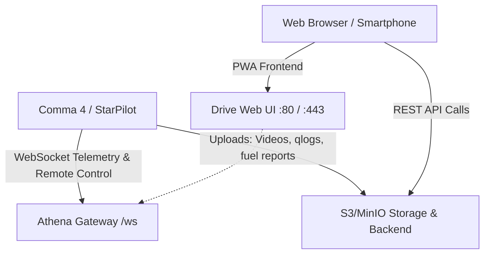

# Self-Hosting Guide für "Drive" auf `drive.markenjaden.de`

Dieser Leitfaden beschreibt Schritt für Schritt, wie du die **Drive** Plattform auf deiner eigenen Domain (`drive.markenjaden.de`) hostest und an dein Comma 4 / StarPilot anbindest.

---

## 1. Architektur-Übersicht

Das Comma Connect / Drive Ökosystem besteht aus 4 Kern-Komponenten:



1. **Drive Web Frontend (dieses Repo):**
   * Progressive Web App (Solid.js + Vite + Tailwind).
   * Wird als statische Dateien über Nginx oder im Docker-Container ausgeliefert.
2. **Connect Backend & API Gateway (`api.drive.markenjaden.de` oder `drive.markenjaden.de/api`):**
   * Verwaltet Benutzer, Authentifizierung (GitHub OAuth / Token), Routen-Metadaten und Geräte-Pairing.
3. **Athena Gateway (`/ws`):**
   * WebSocket-Server für Live-Telemetrie, Live-View-Streaming und Remote-SSH zum Comma 4.
4. **Log- & Video-Speicher (MinIO / S3 oder lokales Dateisystem):**
   * Speichert `.hevc` Videoclips, `qlog` Telemetriebündel und Spritverbrauchsberichte.

---

## 2. Schnelle Bereitstellung mit Docker & Docker-Compose

### `docker-compose.yml` Vorlage

Erstelle auf deinem Server ein Verzeichnis `~/drive-server` mit folgender `docker-compose.yml`:

```yaml
version: '3.8'

services:
  # 1. Drive Web UI
  drive-web:
    build:
      context: .
      dockerfile: Dockerfile
    container_name: drive_web
    restart: always
    environment:
      - VITE_API_URL=https://drive.markenjaden.de
      - VITE_ATHENA_URL=wss://drive.markenjaden.de/ws
    ports:
      - "3000:80"

  # 2. MinIO S3 Object Storage für Fahrtenvideos & Logs
  minio:
    image: minio/minio:latest
    container_name: drive_minio
    restart: always
    command: server /data --console-address ":9001"
    environment:
      - MINIO_ROOT_USER=admin
      - MINIO_ROOT_PASSWORD=DeinSicheresPasswort123!
    volumes:
      - minio_data:/data
    ports:
      - "9000:9000"
      - "9001:9001"

volumes:
  minio_data:
```

---

## 3. Nginx Reverse-Proxy & SSL Konfiguration

Erstelle die Nginx-Konfigurationsdatei `/etc/nginx/sites-available/drive.markenjaden.de`:

```nginx
server {
    listen 80;
    server_name drive.markenjaden.de;
    return 301 https://$host$request_uri;
}

server {
    listen 443 ssl http2;
    server_name drive.markenjaden.de;

    ssl_certificate /etc/letsencrypt/live/drive.markenjaden.de/fullchain.pem;
    ssl_certificate_key /etc/letsencrypt/live/drive.markenjaden.de/privkey.pem;

    # Gzip Compression
    gzip on;
    gzip_types text/plain text/css application/json application/javascript text/xml application/xml;

    # 1. Drive Web UI (Frontend)
    location / {
        proxy_pass http://127.0.0.1:3000;
        proxy_set_header Host $host;
        proxy_set_header X-Real-IP $remote_addr;
        proxy_set_header X-Forwarded-For $proxy_add_x_forwarded_for;
        proxy_set_header X-Forwarded-Proto $scheme;
    }

    # 2. Athena WebSocket Endpoint
    location /ws {
        proxy_pass http://127.0.0.1:8080;
        proxy_http_version 1.1;
        proxy_set_header Upgrade $http_upgrade;
        proxy_set_header Connection "upgrade";
        proxy_set_header Host $host;
        proxy_read_timeout 86400s;
        proxy_send_timeout 86400s;
    }

    # 3. Video- und Routen-Storage (MinIO / S3 Proxy)
    location /storage/ {
        proxy_pass http://127.0.0.1:9000/;
        proxy_set_header Host $host;
        client_max_body_size 500M;
    }
}
```

SSL-Zertifikat mit Let's Encrypt / Certbot erstellen:
```bash
sudo certbot --nginx -d drive.markenjaden.de
```

---

## 4. StarPilot Konfiguration

1. In StarPilot ist `drive.markenjaden.de` als auswählbarer Upload- & Connect-Server hinterlegt.
2. Sobald `UseDriveServer` auf deinem Comma 4 aktiviert ist, sendet das Gerät alle Telemetriedaten, Routen und Verbrauchsberichte direkt an `https://drive.markenjaden.de`.
